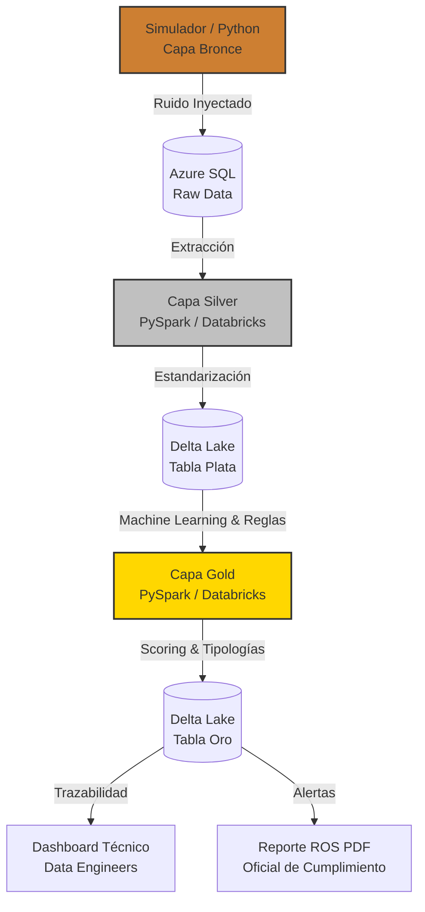

# AML End-to-End Pipeline: Simulación y Procesamiento de Datos

> **Cumplimiento Normativo:** Este proyecto está diseñado con un fuerte enfoque en los lineamientos del **GAFI / FATF** (Grupo de Acción Financiera Internacional) y las normativas locales peruanas como la **Resolución SBS N° 2660-2015**, implementando controles estrictos para la prevención del lavado de activos y del financiamiento del terrorismo (PLAFT).

## Ciclo de Vida de los Datos (Data Flow)



Este proyecto genera un conjunto de datos sintéticos (DataFrames de Pandas) que simula transacciones financieras y perfiles de usuarios. Estos datos están diseñados como la capa de origen (Bronze Layer) para un pipeline analítico en herramientas como Databricks y bases de datos transaccionales como Azure SQL.

## Índice
1. [Arquitectura y Estructura del Repositorio](#arquitectura-y-estructura-del-repositorio)
2. [Arquitectura de Datos (Esquema Estrella)](#arquitectura-de-datos-esquema-estrella)
3. [Estructura Orientada a Objetos (POO)](#estructura-orientada-a-objetos-poo)
4. [Data Quality (Inyección de Ruido - Capa Bronce)](#data-quality-inyección-de-ruido---capa-bronce)
5. [Pipeline Analítico (Arquitectura Medallón)](#pipeline-analítico-arquitectura-medallón)
6. [Nuevas Funcionalidades (Updates Recientes)](#nuevas-funcionalidades-updates-recientes)
7. [CI/CD y Automatización](#cicd-y-automatización)
8. [Despliegue y Contenerización (Docker)](#despliegue-y-contenerización-docker)
9. [Configuración y Ejecución](#configuración-y-ejecución)
10. [Visualización y Reportes](#visualización-y-reportes)

---

## Arquitectura y Estructura del Repositorio

El repositorio sigue un diseño modular por capas alineado con la arquitectura medallón y la automatización continua (CI/CD):

```text
├── .github/
│   └── workflows/
│       └── aml_pipeline.yml      # Automatización CI/CD con GitHub Actions (ejecución programada de Capa Bronce)
├── capa_bronze/                  # Generación y simulación de datos sintéticos (Raw Data)
│   ├── clases_actores.py         # Modelado POO de perfiles legítimos y patrones de lavado de dinero
│   ├── config.py                 # Parámetros generales y configuración de la simulación
│   ├── data_quality.py           # Inyección controlada de anomalías y datos sucios (15%)
│   ├── db_connection.py          # Conector y carga de datos hacia Azure SQL Database
│   ├── main.py                   # Orquestador principal de generación y persistencia
│   └── requirements.txt          # (Obsoleto) Dependencias locales de capa bronce
├── capa_silver/                  # Limpieza, estandarización y transformación Delta Lake
│   └── capa_plata_AML.ipynb      # Notebook de PySpark para la capa plata
├── capa_gold/                    # Detección de anomalías, Machine Learning y Reglas AML
│   └── capa_oro_AML.ipynb        # Notebook de PySpark y Delta Lake para Databricks
├── reporte/                      # Reportes de trazabilidad y de inteligencia financiera
│   ├── databricks_aml_gold_analysis.ipynb # Dashboard interactivo (Plotly) y Data Lineage
│   └── generar_reporte.py        # Script/Notebook nativo para Databricks (generador de ROS en PDF)
├── Dockerfile                    # Receta de la imagen Docker (Python 3.10, PySpark, ODBC)
├── docker-compose.yml            # Orquestador de contenedores para entorno unificado
├── .env.example                  # Plantilla de variables de entorno para Docker
├── requirements.txt              # Dependencias globales unificadas para todo el proyecto
├── .gitignore                    # Exclusiones de control de versiones
└── README.md                     # Documentación integral del proyecto
```

## Arquitectura de Datos (Esquema Estrella)

El modelo dimensional está compuesto por:

1. **Dim_Cliente:** Tabla de dimensiones con datos demográficos (Edad, Ocupación y un ingreso aproximado).
2. **Fact_Transacciones:** Tabla de hechos con los eventos transaccionales, orígenes, destinos y geografía.

## Estructura Orientada a Objetos (POO)

El proyecto utiliza una clase base `PerfilFinanciero` en `capa_bronze/clases_actores.py` de la que heredan:
- `ClienteNormal`: Tráfico y compras legítimas ("ruido blanco" o camuflaje).
- `PitufoBancario`: Fracciona montos ilícitos (Structuring) en días consecutivos en efectivo.
- `LavadorPlataformas`: Recibe múltiples micro-pagos de varias cuentas y retira sistemáticamente por debajo del límite de $10,000 USD.
- `LavadorCrypto`: Realiza saltos ("hops") desde orígenes dispersos hacia una billetera central (Bridge) y envía el acumulado a un Exchange centralizado en cuotas.

## Data Quality (Inyección de Ruido - Capa Bronce)

El módulo `capa_bronze/data_quality.py` se encarga de introducir, mediante el uso de operaciones vectorizadas y NumPy, un 15% de ruido (Data Sucia). Puede generar:
- Tipos de fecha inconsistentes (DD/MM/YYYY en vez de YYYY-MM-DD).
- Errores tipográficos en la columna de monedas.
- Identificadores PK nulos (`NaN`) inyectados mediante concatenación (*append*) para no destruir datos válidos originales.
- Filas duplicadas transaccionales.

## Pipeline Analítico (Arquitectura Medallón)

El proyecto implementa una arquitectura medallón para el procesamiento y transformación de los datos:

### Capa Bronze (Raw Data)
Contiene los datos crudos generados por el simulador (`capa_bronze/`), incluyendo el ruido y las inconsistencias inyectadas intencionalmente para validar los procesos de limpieza. Los datos se almacenan en bases de datos relacionales (Azure SQL) y almacenes locales.

### Capa Silver (Limpieza y Estandarización)
Implementada en `capa_silver/` mediante notebooks de PySpark (`capa_plata_AML.ipynb`), esta capa procesa los datos de la capa Bronze aplicando reglas de calidad:
- Eliminación de registros con claves primarias nulas (`PK_Transaccion`).
- Limpieza y formateo de montos numéricos conservando precisión financiera a 2 decimales (`double`).
- Filtrado de transacciones no válidas (ej. monto cero o negativo).
- Eliminación de registros transaccionales duplicados.
- Estandarización de cadenas de texto (eliminación de espacios y conversión a mayúsculas para códigos de `Moneda`).
- Almacenamiento y actualización en formato Delta Lake utilizando operaciones `MERGE` (Upsert) dentro de la tabla gestionada en Databricks: **`transacciones_plata_robert`**.

### Capa Gold (Machine Learning, Reglas de Negocio y Compliance AML)
Ubicada en `capa_gold/` (con notebook `capa_oro_AML.ipynb` para Databricks), esta capa consume directamente la tabla limpia **`transacciones_plata_robert`** y la dimensión de clientes (`Dim_Cliente`) para consolidar el valor analítico y de cumplimiento normativo mediante un enfoque híbrido:

1. **Ingeniería de Características:**
   - Agregaciones transaccionales bidireccionales (fondos enviados/recibidos, volumen, promedios, desviaciones).
   - Ratios de comportamiento: flujo de entrada vs. salida (`Ratio_Salida_vs_Entrada`), índice de concentración/embudo (`Indice_Fan_In`) y ratio de riesgo cripto (`Ratio_Tx_Crypto`).
   - Comparativa contra el perfil KYC: desvío transaccional respecto al ingreso declarado (`Ratio_Operado_vs_Ingreso_Declarado`).

2. **Detección de Anomalías con Machine Learning:**
   - Modelo no supervisado **Isolation Forest** entrenado sobre las variables de comportamiento.
   - Cálculo de score normalizado de anomalía matemática (`ML_Anomaly_Score`).

3. **Motor de Reglas y Clasificación de Tipologías AML:**
   - **Estructuración / Pitufeo (`Flag_Structuring_Pitufeo`):** Fraccionamiento de transacciones $\le \$3,000$ acumulando sumas cercanas al umbral de $\$10,000$ USD.
   - **Embudo de Plataformas (`Flag_Fan_In_Plataforma`):** Múltiples micro-pagos entrantes con retiro consolidado posterior.
   - **Saltos Cripto / Mixer (`Flag_Crypto_Mixer`):** Transferencias escalonadas hacia Exchanges/Billeteras puente.
   - **Inconsistencia KYC (`Flag_Desvio_KYC`):** Actividad operativa desproporcionada frente al ingreso mensual declarado.
   - Score compuesto ponderado (`AML_Risk_Score`) y clasificación en:
     - `ALTO RIESGO - ALERTA ROS` (Score $\ge 70$)
     - `MEDIO RIESGO - MONITOREO` (Score $40 - 69.9$)
     - `BAJO RIESGO - NORMAL` (Score $< 40$)

4. **Tablas Delta / Datasets de Salida:**
   - **`gold_perfiles_riesgo_cliente`:** Perfil 360 del cliente con métricas agregadas, scores de riesgo y tipologías detectadas.
   - **`gold_alertas_aml`:** Detalle transaccional de operaciones alertadas para la generación de Reportes de Operaciones Sospechosas (ROS / SAR).

## Nuevas Funcionalidades (Updates Recientes)

- **Volumen Transaccional Realista:** La Capa Bronce ahora genera dinámicamente un número de registros aproximado (ej. de 9500 a 10500) por ejecución, aportando variabilidad realista en vez de un número estático.
- **Protección de Data Válida:** La inyección de valores nulos se hace por anexado (*append*), asegurando que el 100% de la data legítima llegue intacta a las capas superiores.
- **Alta Precisión Financiera:** La Capa Plata ahora convierte y procesa todos los montos a formato *Double* redondeando exactamente a dos decimales, erradicando el truncado a enteros y protegiendo información monetaria crucial.
- **Reporte ROS Nativo en Databricks:** Se rediseñó la arquitectura de reportes. Ahora el script `reporte/generar_reporte.py` se ejecuta **nativamente como un Job/Notebook en Databricks** interactuando directamente con Spark SQL, permitiendo generar el PDF oficial del ROS consultando las capas Delta sin latencia y con data 100% verídica.

## CI/CD y Automatización

1. **Automatización de Generación de Data (Capa Bronce):** El archivo `aml_pipeline.yml` dentro de `.github/workflows` orquesta la ejecución desatendida del simulador en **GitHub Actions**:
   - Ejecución diaria programada vía `cron`.
   - Inyección automatizada de nuevos lotes transaccionales a Azure SQL Database.

2. **Automatización Analítica (Databricks Jobs):** Toda la lógica de transformación de las capas Silver y Gold, así como la generación automatizada de reportes ROS, está centralizada en **Databricks Workflows (Jobs)**.
   - Existe un *trigger* programado que se ejecuta automáticamente de forma diaria a las **9:00 AM**.
   - El pipeline orquesta en cadena: Notebook Capa Plata -> Notebook Capa Oro -> Script Generador de ROS.
   - Incluye **alertas y notificaciones por correo electrónico** ante cualquier fallo en las tareas del pipeline para garantizar una monitorización proactiva por parte del equipo de ingeniería de datos.

## Despliegue y Contenerización (Docker)

Todo el pipeline ha sido contenerizado utilizando Docker para garantizar la portabilidad y la reproducibilidad del entorno en cualquier máquina.

1. **Imagen Base**: Se utiliza `python:3.10-slim` (basada en Debian) para mantener un tamaño ligero pero asegurando la compatibilidad con repositorios del sistema.
2. **Dependencias Críticas Integradas**: El contenedor instala automáticamente **Java (JRE)** (obligatorio para la ejecución de PySpark) y el **Microsoft ODBC Driver 18 for SQL Server** (necesario para las conexiones hacia Azure SQL).
3. **Gestión Unificada**: Se integró un único `requirements.txt` con todas las dependencias necesarias (`pandas`, `pyodbc`, `pyspark`, `delta-spark`, `scikit-learn`, `plotly`, `jupyterlab`).
4. **Orquestación**: El archivo `docker-compose.yml` permite levantar el proyecto y expone un servidor de JupyterLab listo para usarse, sincronizando tu código local con el contenedor mediante volúmenes.

## Configuración y Ejecución

### 1. Ejecución Unificada vía Docker (Recomendado)
Para evitar conflictos de dependencias e instalación de drivers, usa el contenedor preconfigurado:
1. Renombra el archivo `.env.example` a `.env` y coloca tu contraseña en la variable `AZURE_DB_PASSWORD`.
2. En la raíz del proyecto, ejecuta:
   ```bash
   docker-compose up --build
   ```
3. Accede a `http://localhost:8888` en tu navegador usando el token `aml123`. Desde allí tendrás un JupyterLab con acceso a todos los scripts y notebooks del proyecto.

### 2. Ejecutar Capa Bronze (Generación y Carga) Localmente
(Normalmente ejecutado vía GitHub Actions, o de forma local).
```bash
cd capa_bronze
pip install -r requirements.txt
python main.py
```

### 3. Ejecutar Capa Silver (Limpieza y Delta Lake)
Ejecutar el notebook `capa_silver/capa_plata_AML.ipynb` en un cluster de **Databricks**, o dejar que el Databricks Job de las 9:00 AM lo procese. También puedes correrlo dentro del contenedor Docker.

### 4. Ejecutar Capa Gold (Machine Learning y Alertas AML)
Ejecutar el notebook `capa_gold/capa_oro_AML.ipynb` (depende de los resultados de la capa Silver).

### 5. Generación Automática de Reporte ROS (PDF)
El generador de reporte (`reporte/generar_reporte.py`) ahora es un script/notebook nativo de PySpark.
Para ejecutarlo:
1. Copia o importa el archivo `generar_reporte.py` a tu Workspace de Databricks (se puede cargar como notebook).
2. Asegúrate de instalar previamente las dependencias de Python (`fpdf`, `pandas`) dentro del entorno del clúster de Databricks.
3. Ejecútalo. El PDF resultante (`Reporte_ROS_Inteligencia_Financiera.pdf`) se guardará en `/databricks/driver/` o en DBFS para que puedas descargarlo usando la UI de Databricks.

## Visualización y Reportes 

### 1. Reporte Técnico para Data Engineers
Dentro del directorio `reporte/` encontrarás el notebook `databricks_aml_gold_analysis.ipynb`. **Este documento está diseñado y enfocado específicamente para Data Engineers y Arquitectos de Datos**. Presenta un resumen técnico completo de las decisiones de diseño del pipeline (Arquitectura Medallion, CDC, Particionamiento Estratégico, Idempotencia, Data Lineage) y utiliza visualizaciones avanzadas (Sankey, Sunburst, 3D Scatter) para demostrar cómo el sistema traza e identifica el flujo de capitales ilícitos a escala directamente desde la Capa Gold.

### 2. Informe ROS para Analistas AML
El nuevo script generador en el pipeline produce el documento corporativo autogenerado destinado al equipo de Prevención de Fraude, con conteo de alertas, patrones identificados e IDs de sujetos críticos. Este archivo PDF se emite diariamente luego del procesamiento en Databricks de las capas Silver y Gold.
