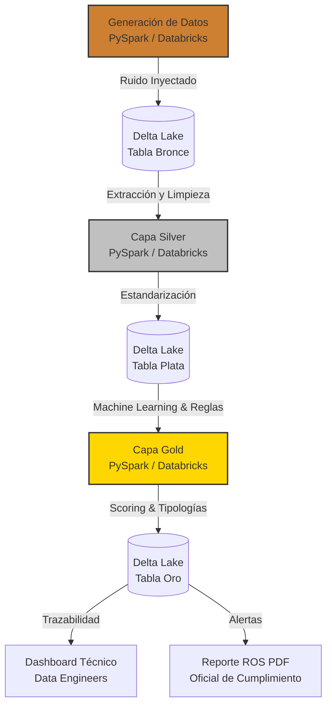

# 🛡️ AML End-to-End Pipeline: Simulación y Procesamiento de Datos

> 🚀 **Simulación a Escala (Big Data):** Este pipeline está optimizado para replicar entornos transaccionales masivos de la vida real, siendo capaz de generar y procesar millones de transacciones por ejecución de forma dinámica de manera nativa y distribuida usando **Databricks** y **PySpark**.
> 
> ⚖️ **Cumplimiento Normativo:** Este proyecto está diseñado con un fuerte enfoque en los lineamientos del **GAFI / FATF** (Grupo de Acción Financiera Internacional) y las normativas locales peruanas como la **Resolución SBS N° 2660-2015**, implementando controles estrictos para la prevención del lavado de activos y del financiamiento del terrorismo (PLAFT).

## 🔄 Ciclo de Vida de los Datos (Data Flow)



Este proyecto genera un conjunto de datos sintéticos (DataFrames de Spark) que simula transacciones financieras y perfiles de usuarios de forma nativa en Databricks, consolidando todas las etapas (Bronce, Plata y Oro) en la arquitectura Medallón dentro del Lakehouse.

## 📑 Índice
1. [Arquitectura y Estructura del Repositorio](#arquitectura-y-estructura-del-repositorio)
2. [Arquitectura de Datos (Esquema Estrella)](#arquitectura-de-datos-esquema-estrella)
3. [Estructura Orientada a Objetos (POO)](#estructura-orientada-a-objetos-poo)
4. [Data Quality (Inyección de Ruido - Capa Bronce)](#data-quality-inyección-de-ruido---capa-bronce)
5. [Pipeline Analítico (Arquitectura Medallón)](#pipeline-analítico-arquitectura-medallón)
6. [Nuevas Funcionalidades (Updates Recientes)](#nuevas-funcionalidades-updates-recientes)
7. [Automatización y Orquestación](#automatización-y-orquestación)
8. [Configuración y Ejecución](#configuración-y-ejecución)
9. [Visualización y Reportes](#visualización-y-reportes)

---

## 🏗️ Arquitectura y Estructura del Repositorio

El repositorio sigue un diseño modular por capas alineado con la arquitectura medallón:

```text
├── capa_bronze/                  # Generación y simulación de datos sintéticos (Raw Data)
│   └── capa_bronce_AML.ipynb     # Notebook de PySpark nativo para Databricks
├── capa_silver/                  # Limpieza, estandarización y transformación Delta Lake
│   └── capa_plata_AML.ipynb      # Notebook de PySpark para la capa plata
├── capa_gold/                    # Detección de anomalías, Machine Learning y Reglas AML
│   └── capa_oro_AML.ipynb        # Notebook de PySpark y Delta Lake para Databricks
├── reporte/                      # Reportes de trazabilidad y de inteligencia financiera
│   ├── databricks_aml_gold_analysis.ipynb # Dashboard interactivo (Plotly) y Data Lineage
│   └── generar_reporte.py        # Script/Notebook nativo para Databricks (generador de ROS en PDF)
├── Dockerfile                    # Receta de la imagen Docker (Entorno de desarrollo unificado)
├── docker-compose.yml            # Orquestador de contenedores para entorno unificado
├── .env.example                  # Plantilla de variables de entorno para Docker
├── requirements.txt              # Dependencias globales unificadas para todo el proyecto
├── .gitignore                    # Exclusiones de control de versiones
└── README.md                     # Documentación integral del proyecto
```

## 🌟 Arquitectura de Datos (Esquema Estrella)

El modelo dimensional almacenado en el catálogo Delta (esquema `aml_proyect` o `aml.proyec`) está compuesto por:

1. **Dim_Cliente:** Tabla de dimensiones con datos demográficos (Edad, Ocupación y un ingreso aproximado).
2. **Fact_Transacciones:** Tabla de hechos con los eventos transaccionales, orígenes, destinos y geografía.

## 🧩 Estructura Orientada a Objetos (POO)

El proyecto utiliza una simulación orientada a objetos (embebida en la Capa Bronce) para crear comportamientos realistas:
- `ClienteNormal`: Tráfico y compras legítimas ("ruido blanco" o camuflaje).
- `PitufoBancario`: Fracciona montos ilícitos (Structuring) en días consecutivos en efectivo.
- `LavadorPlataformas`: Recibe múltiples micro-pagos de varias cuentas y retira sistemáticamente por debajo del límite de $10,000 USD.
- `LavadorCrypto`: Realiza saltos ("hops") desde orígenes dispersos hacia una billetera central (Bridge) y envía el acumulado a un Exchange centralizado en cuotas.

## 🧹 Data Quality (Inyección de Ruido - Capa Bronce)

La Capa Bronce se encarga de generar los datos y de introducir un 15% de ruido (Data Sucia) utilizando User-Defined Functions (UDFs) distribuidas de Pandas/PySpark. Puede generar:
- Tipos de fecha inconsistentes (DD/MM/YYYY en vez de YYYY-MM-DD).
- Errores tipográficos en la columna de monedas.
- Identificadores PK nulos (`NaN`).
- Filas duplicadas transaccionales.

## 🏅 Pipeline Analítico (Arquitectura Medallón)

El proyecto implementa una arquitectura medallón para el procesamiento y transformación de los datos íntegramente en Databricks:

### 🥉 Capa Bronze (Raw Data)
El notebook `capa_bronce_AML.ipynb` orquesta la simulación paralela y genera los datos crudos, almacenándolos directamente en las tablas Delta `transacciones_bronce` y `clientes_bronce` dentro de Databricks.

### 🥈 Capa Silver (Limpieza y Estandarización)
Implementada en `capa_plata_AML.ipynb`, esta capa procesa los datos de la capa Bronze aplicando reglas de calidad:
- Eliminación de registros con claves primarias nulas y duplicadas.
- Limpieza y formateo de montos numéricos conservando precisión financiera a 2 decimales (`double`).
- Estandarización de cadenas de texto (eliminación de espacios y conversión a mayúsculas para códigos de `Moneda`).
- Almacenamiento y actualización en formato Delta Lake utilizando operaciones `MERGE` (Upsert) en la tabla gestionada en Databricks: **`transacciones_plata_robert`** y **`clientes_plata_robert`**.

### 🥇 Capa Gold (Machine Learning, Reglas de Negocio y Compliance AML)
El notebook `capa_oro_AML.ipynb` consume directamente las tablas limpias de la capa plata para consolidar el valor analítico y de cumplimiento normativo mediante un enfoque híbrido:

1. **Ingeniería de Características:** Cómputo de ratios avanzados y agregaciones.
2. **Detección de Anomalías con Machine Learning:** Modelo no supervisado **Isolation Forest** para cálculo de score matemático.
3. **Motor de Reglas y Clasificación AML:** Detección de Structuring, Fan-in de Plataformas, Mixers Cripto y Desvío de KYC. Se asigna un Score compuesto y Nivel de Riesgo (ALTO, MEDIO, BAJO).
4. **Tablas Delta de Salida:** Se escriben `gold_perfiles_riesgo_cliente` y `gold_alertas_aml`.

## ✨ Nuevas Funcionalidades (Updates Recientes)

- **Migración 100% nativa a Databricks (PySpark):** La generación de datos que antes se realizaba en un contenedor local o GitHub Actions ahora se ejecuta de forma completamente nativa y distribuida en Databricks. Las clases de simulación se integraron con `mapInPandas` (Pandas UDFs) para procesar millones de transacciones de forma hiper-eficiente.
- **Orquestación Sin Fricciones:** Todo el flujo se consolida en un Workspace de Databricks sin dependencia externa, previniendo errores de red, sobrecargas de memoria del driver y limitantes de espacio local.
- **Limpieza de Clientes:** La capa Silver ahora limpia tanto la tabla transaccional como la de clientes antes de inyectarlas en el modelo, asegurando total integridad.

## ⚙️ Automatización y Orquestación

Toda la lógica de transformación (Bronze -> Silver -> Gold), así como la generación de reportes, está centralizada en **Databricks Workflows (Jobs)**.
- Puedes crear un Job programado que ejecute secuencialmente los tres notebooks.
- Esto reemplaza completamente el pipeline antiguo basado en GitHub Actions, centralizando el monitoreo, escalabilidad y notificaciones de éxito/error directamente dentro del Lakehouse.

## 🚀 Configuración y Ejecución

Para desplegar y ejecutar este pipeline:

1. Importa los tres notebooks (`capa_bronze/capa_bronce_AML.ipynb`, `capa_silver/capa_plata_AML.ipynb`, `capa_gold/capa_oro_AML.ipynb`) en tu Workspace de Databricks.
2. Crea un **Databricks Job (Workflow)**.
3. Añade las tareas en secuencia:
   - Tarea 1: Ejecutar `capa_bronce_AML`
   - Tarea 2: Ejecutar `capa_plata_AML` (depende de Tarea 1)
   - Tarea 3: Ejecutar `capa_oro_AML` (depende de Tarea 2)
4. Ejecuta el Job. Las tablas se crearán automáticamente en el esquema `workspace.aml_proyect` o en tu catálogo/esquema configurado por defecto.

## 📊 Visualización y Reportes 

### 1. Reporte Técnico para Data Engineers
El notebook `databricks_aml_gold_analysis.ipynb` presenta un resumen técnico completo de las decisiones de diseño del pipeline y utiliza visualizaciones avanzadas.

### 2. Informe ROS para Analistas AML
El script generador `generar_reporte.py` (ejecutable como Notebook en Databricks) produce un PDF autogenerado con conteo de alertas e IDs críticos basados en las tablas de la capa Gold.

### 3. Dashboard Ejecutivo para la Gerencia
Se incluye el archivo `AML_Transaction_Status_Dashboard.lvdash.json`, un **Dashboard Ejecutivo** nativo de Databricks (Lakeview Dashboard) que proporciona una vista de alto nivel con KPIs clave de alertas.
